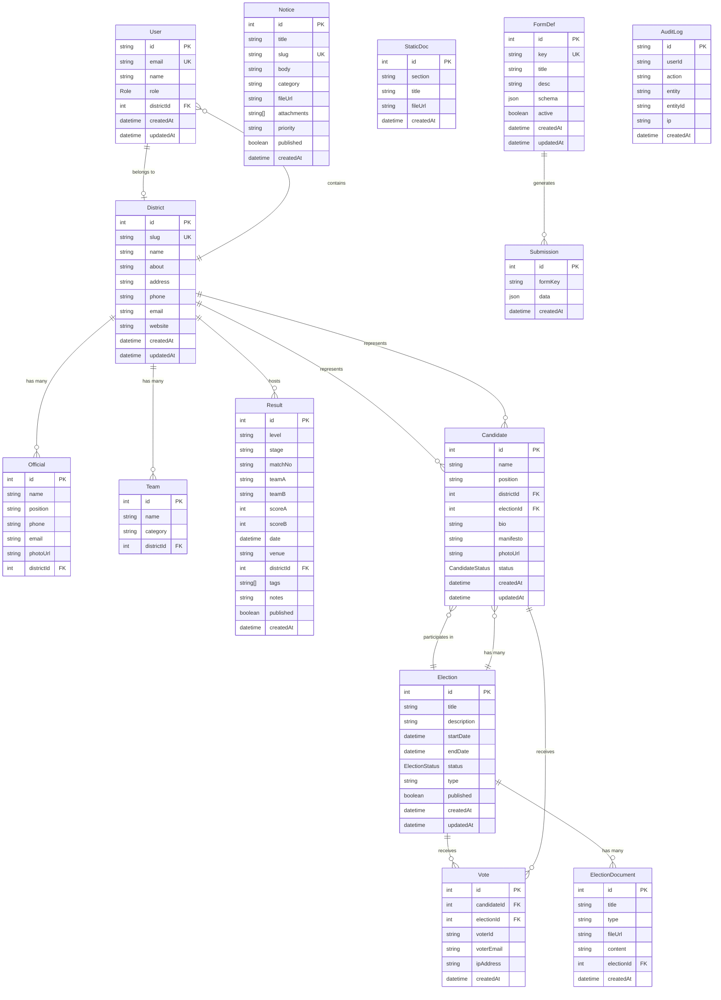
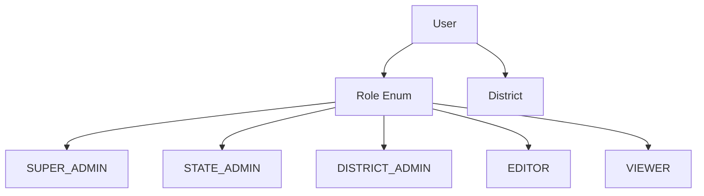
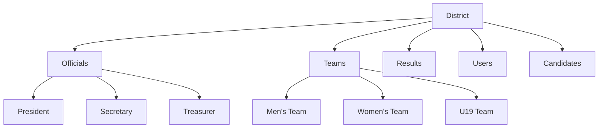
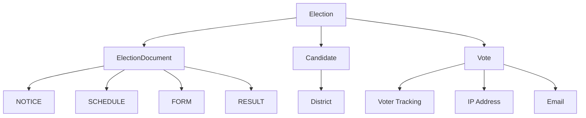
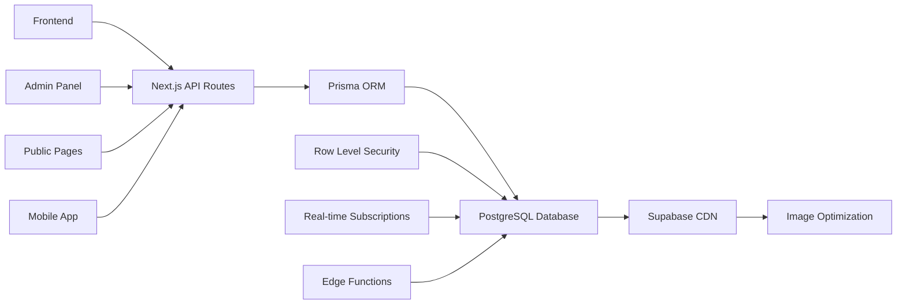

# 🗄️ Database Schema Documentation

## 📊 Overview

The Maharashtra Sepaktakraw Association database is built on **PostgreSQL** with **Supabase** as the hosting platform. The schema is designed to support a comprehensive sports association management system with user roles, districts, officials, teams, results, notices, elections, and more.

## 🏗️ Architecture

```
┌─────────────────────────────────────────────────────────────┐
│                    SUPABASE POSTGRESQL                     │
├─────────────────────────────────────────────────────────────┤
│  • Row Level Security (RLS)                                │
│  • Real-time subscriptions                                 │
│  • CDN for image optimization                              │
│  • Edge functions for serverless operations                │
└─────────────────────────────────────────────────────────────┘
```

## 📋 Entity Relationship Diagram



## 🏢 Core Entities

### 1. **User Management**


**Purpose**: Manages user authentication, authorization, and role-based access control.

**Key Features**:
- UUID-based primary keys for security
- Role-based permissions (5 levels)
- District association for localized access
- Audit trail integration

### 2. **District Management**


**Purpose**: Central entity for organizing the association geographically.

**Key Features**:
- Unique slug for SEO-friendly URLs
- Complete contact information
- Hierarchical organization structure
- Cascade deletion for data integrity

### 3. **Elections System**


**Purpose**: Complete democratic voting system for association governance.

**Key Features**:
- Multiple election types (General, By-election, Special)
- Document management for election materials
- Secure voting with duplicate prevention
- Real-time vote counting and statistics

## 🔗 Relationship Types

### One-to-Many Relationships
- **District → Officials**: One district has many officials
- **District → Teams**: One district has many teams
- **District → Results**: One district can host many matches
- **Election → Candidates**: One election has many candidates
- **Election → Votes**: One election receives many votes

### Many-to-One Relationships
- **Official → District**: Many officials belong to one district
- **Team → District**: Many teams belong to one district
- **Candidate → District**: Many candidates can represent one district
- **Vote → Election**: Many votes belong to one election

### Self-Referencing Relationships
- **User → District**: Users can be associated with districts
- **Result → District**: Results can be associated with hosting districts

## 📊 Data Flow Architecture



## 🛡️ Security Features

### Row Level Security (RLS)
```sql
-- Example RLS Policy
CREATE POLICY "Users can view their own data" ON "User"
FOR SELECT USING (auth.uid() = id);

CREATE POLICY "Public can view published content" ON "Notice"
FOR SELECT USING (published = true);
```

### Data Validation
- **Email uniqueness** across users
- **Slug uniqueness** for SEO-friendly URLs
- **Foreign key constraints** for data integrity
- **Enum validation** for status fields
- **JSON schema validation** for form definitions

## 📈 Performance Optimizations

### Indexing Strategy
```sql
-- Primary indexes
CREATE INDEX "User_email_idx" ON "User"("email");
CREATE INDEX "District_slug_idx" ON "District"("slug");
CREATE INDEX "Result_date_idx" ON "Result"("date");
CREATE INDEX "Notice_createdAt_idx" ON "Notice"("createdAt");

-- Composite indexes
CREATE INDEX "Vote_election_candidate_idx" ON "Vote"("electionId", "candidateId");
CREATE INDEX "Result_district_date_idx" ON "Result"("districtId", "date");
```

### CDN Integration
- **Supabase Storage** for file uploads
- **Image optimization** with automatic resizing
- **Edge caching** for static content
- **Global distribution** for fast loading

## 🔄 Data Lifecycle

### Creation Flow
1. **User Registration** → User table
2. **District Assignment** → User-District relationship
3. **Content Creation** → Notices, Results, Elections
4. **Audit Logging** → All changes tracked

### Update Flow
1. **Authentication Check** → Role-based access
2. **Data Validation** → Schema compliance
3. **Update Execution** → Atomic transactions
4. **Audit Trail** → Change logging

### Deletion Flow
1. **Cascade Rules** → Related data cleanup
2. **Soft Delete** → For important entities
3. **Archive Strategy** → Historical data preservation
4. **Audit Preservation** → Permanent change records

## 📱 API Integration

### RESTful Endpoints
```
GET    /api/users           # List users
POST   /api/users           # Create user
GET    /api/users/[id]      # Get user
PUT    /api/users/[id]      # Update user
DELETE /api/users/[id]      # Delete user

GET    /api/districts       # List districts
GET    /api/districts/[slug] # Get district by slug
GET    /api/officials       # List officials
GET    /api/results         # List results
GET    /api/notices         # List notices
GET    /api/elections       # List elections
POST   /api/elections/[id]/vote # Cast vote
```

### Real-time Subscriptions
```javascript
// Real-time vote counting
const subscription = supabase
  .channel('election-votes')
  .on('postgres_changes', {
    event: 'INSERT',
    schema: 'public',
    table: 'Vote'
  }, (payload) => {
    updateVoteCount(payload.new);
  })
  .subscribe();
```

## 🎯 Business Logic

### User Roles Hierarchy
```
SUPER_ADMIN (Level 5)
├── Full system access
├── User management
└── System configuration

STATE_ADMIN (Level 4)
├── State-wide operations
├── District management
└── Election oversight

DISTRICT_ADMIN (Level 3)
├── District-specific operations
├── Official management
└── Local elections

EDITOR (Level 2)
├── Content creation
├── Result entry
└── Notice publishing

VIEWER (Level 1)
├── Read-only access
├── Public content viewing
└── Voting participation
```

### Election Workflow
```
1. Election Creation
   ├── Set dates and parameters
   ├── Create documents
   └── Publish notice

2. Candidate Registration
   ├── Submit nominations
   ├── Review applications
   └── Approve candidates

3. Voting Period
   ├── Open voting
   ├── Monitor participation
   └── Prevent duplicates

4. Results
   ├── Close voting
   ├── Count votes
   └── Announce winners
```

## 🔧 Maintenance & Monitoring

### Database Health Checks
- **Connection monitoring**
- **Query performance analysis**
- **Storage usage tracking**
- **Backup verification**

### Data Integrity
- **Foreign key constraints**
- **Check constraints**
- **Unique constraints**
- **Not null constraints**

### Backup Strategy
- **Daily automated backups**
- **Point-in-time recovery**
- **Cross-region replication**
- **Disaster recovery plan**

---

## 🚀 Getting Started

### 1. Database Setup
```bash
# Run migrations
npx prisma db push

# Generate client
npx prisma generate

# Seed data
npm run seed
```

### 2. Environment Configuration
```env
DATABASE_URL="postgresql://..."
DIRECT_URL="postgresql://..."
NEXT_PUBLIC_SUPABASE_URL="https://..."
NEXT_PUBLIC_SUPABASE_ANON_KEY="..."
```

### 3. RLS Policies
```sql
-- Enable RLS on all tables
ALTER TABLE "User" ENABLE ROW LEVEL SECURITY;
ALTER TABLE "District" ENABLE ROW LEVEL SECURITY;
-- ... (repeat for all tables)
```

---

**📊 This schema supports a comprehensive sports association management system with modern features like real-time updates, secure voting, role-based access, and scalable architecture.**
